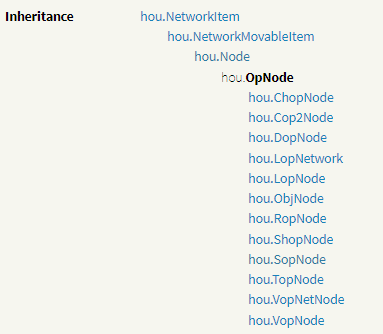

In this article, I'll walk you through every step to set up your Visual Studio Code so you have full autocomplete support for Houdini Python Development. I will also explain some concepts related to IntelliSense, VSCode, and Python, so hopefully, you learn useful stuff along the way •ᴗ•

```callout { type="info" }
**IntelliSense** is a general term for various code editing features including code completion, parameter info, quick info, and member lists.
```

If you follow through everything, you should end up with something like this:


```callout { type="warning" }
This article was made on Windows and might give wrong information if you are using macOS or Linux. You will still find useful information, but keep this in mind and do your own research if needed.
```

## VSCode Profile Setup

If it is not already done, [download VSCode](https://code.visualstudio.com/download), then open it.

We will create a **Profile**, this way, all the configuration of VSCode we'll do in this article will only affect this profile. If at some point you need to configure other stuff for other uses of VSCode, you can create another profile and put your other configuration there, and switch between the two easily ಠ‿<

Follow all these steps:
- Under `Bottom Left Gear > Profiles`, click on `Create Profile...`
- Type `Houdini` as the profile name
- Select an **Icon** that suits you
- Uncheck everything except `Settings` and `Extensions`
- Press **Create**

Your **Houdini Profile** is created, It has its own **Settings** and **Extensions**; the rest is inherited from your default VSCode settings.

Make sure you are currently using the **Houdini Profile**, the bottom left gear should have switched to your Profile Icon, if it is not the case : Under `Bottom Left Gear > Profiles` click on `Houdini`.

```callout { type="important" }
Always make sure this Profile is the one being used when you want to have Houdini IntelliSense in the future.
```

Go to the Extensions Section of VSCode (`Left Bar > Icon with multiple cubes and one detached`), search for `Python` and install the first one, this is necessary for programming Python in VSCode. After installation, if you remove the search query (`python` that you've typed just before), you should see your installed packages : **Python**, **Pylance** and **Python Debugger**.
When you've installed Python, it automatically installed the other two.

```callout { type="info" }
**Pylance** is the **Language Server** of Python in VSCode, just know that this guy is the one responsible for all the IntelliSense stuff ಠ‿<
```

We are now done with the Extensions, press `CTRL + SHIFT + P` (or the equivalent shortcut to open the **Command Palette** in your OS), and search for `Open User Settings (JSON)`. This should open an empty `settings.json` file, it's your VSCode Profile's configuration, keep this one open on the side, we will put some stuff in there to make everything work !

## Complete the `settings.json`

**Open Houdini**, under `obj/` context place a **Geometry Node**, dive in and place a **Python Node**, past the code below in it.

```python
import sys
import pathlib
import json

vscode_settings = {}

pythonexe_path = pathlib.Path(sys.prefix).resolve().joinpath('python.exe')
vscode_settings['python.defaultInterpreterPath'] = pythonexe_path.as_posix()

sys_paths = [pathlib.Path(p).resolve() for p in sys.path]
vscode_settings['python.analysis.extraPaths'] = [p.as_posix() for p in sys_paths]

vscode_settings['python.analysis.stubPath'] = 'D:/REPLACE/WITH/YOUR/STUB/PATH'

print(json.dumps(vscode_settings, indent=4))
```

While the cursor is inside the **Python Node** press `CTRL + Enter` to cook the code, you should see the **Houdini Console** appear with some content in it, this is your **VSCode settings** ಠ‿<



Select everything and paste it in the `settings.json` of VSCode (replacing anything that was already there).

```callout { type="tip" }
If you don't see the **Houdini Console** appear with your content, that might mean that a **Python Shell** window is present in your Houdini Desktop, when this is the case print tend to end up there instead of the **Houdini Console**.
You can copy the **VSCode settings** from there or hide the **Python Shell** and re-cook the **Python Node** (by adding a random line return in the end and pressing `CTRL + Enter`)
```

Your `settings.json` should look something like this now:
```json
{
    "python.defaultInterpreterPath": "D:/Programs/Side Effects Software/Houdini 20.0.688/python310/python.exe",
    "python.analysis.extraPaths": [
        "D:/Programs/Side Effects Software/Houdini 20.0.688/python310/lib/site-packages-ui-forced",
        "D:/Programs/Side Effects Software/Houdini 20.0.688/python310/lib/site-packages-forced",
        "C:/Users/user",
        "D:/user/Documents/_Synced/Art/houdini/_HoudiSync/python",
        "D:/Programs/Side Effects Software/Houdini 20.0.688/bin/python310.zip",
        "D:/Programs/Side Effects Software/Houdini 20.0.688/python310/dlls",
        "D:/Programs/Side Effects Software/Houdini 20.0.688/python310/lib",
        "D:/Programs/Side Effects Software/Houdini 20.0.688/bin",
        "D:/Programs/Side Effects Software/Houdini 20.0.688/python310",
        "D:/Programs/Side Effects Software/Houdini 20.0.688/python310/lib/site-packages",
        "D:/Programs/Side Effects Software/Houdini 20.0.688/packages/kinefx/python3.10libs",
        "D:/Programs/Side Effects Software/Houdini 20.0.688/packages/apex/python3.10libs",
        "D:/Programs/Side Effects Software/Houdini 20.0.688/houdini/python3.10libs",
        "D:/Programs/Side Effects Software/sidefx_packages/SideFXLabs20.0/scripts/python",
        "D:/Programs/Side Effects Software/Houdini 20.0.688/packages/kinefx/viewer_states",
        "D:/Programs/Side Effects Software/Houdini 20.0.688/packages/apex/viewer_states",
        "D:/user/Documents/_Synced/Art/houdini/_HoudiSync/viewer_states",
        "D:/Programs/Side Effects Software/Houdini 20.0.688/houdini/viewer_states",
        "D:/Programs/Side Effects Software/Houdini 20.0.688/packages/kinefx/viewer_handles",
        "D:/user/Documents/_Synced/Art/houdini/_HoudiSync/viewer_handles",
        "D:/Programs/Side Effects Software/Houdini 20.0.688/houdini/viewer_handles",
        "D:/Programs/Side Effects Software/Houdini 20.0.688/python310/lib/site-packages",
        "D:/Programs/Side Effects Software/sidefx_packages/SideFXLabs20.0/viewer_states"
    ],
    "python.analysis.stubPath": "D:/REPLACE/WITH/YOUR/STUB/PATH"
}
```



The script was able to retrieve all this useful information because it has run inside a **Python Node** inside **Houdini**. That mean it is Houdini's Python interpreter that have been used, and using `sys` Module it was able to retrieve path information about where the Python Executable is located, plus additional information on the **Module Search Paths**[^src-syspath] (`sys.path`).
[^src-syspath]: [Doc - Python - Module search path ](https://docs.python.org/3/library/sys_path_init.html#the-initialization-of-the-sys-path-module-search-path)

The **Module Search Paths** as the name imply is a list of Paths containing modules that Python should be aware of, this list of path can be accessed and modified during runtime through `sys.path`. The **PYTHONPATH**[^src-pythonpath] is an optional environment variable that feed its content into the Module Search Path, but isn't the only source.
[^src-pythonpath]: [Doc - Python - PYTHONPATH ](https://docs.python.org/3/using/cmdline.html#envvar-PYTHONPATH)

So, Houdini Python have its own **Module Search Paths**[^src-houmodules], which have been filled by multiple sources such as : the **PYTHONPATH** environment variable, `houdini.env`, packages, and other internal stuffs. By running this script, we retrieved the full list of path that Houdini was currently using, and by adding this to the VSCode's `python.analysis.extraPaths` setting, our code editor is now aware of all the module Houdini is using.
[^src-houmodules]: [Doc - Houdini - Modules on disk](https://www.sidefx.com/docs/houdini/hom/locations.html#disk)

```callout { type="tip" }
Don't hesitate to rerun this script anytime you modify your Houdini environment, this way you will be certain to always have all the paths up to date in VSCode.
```



If you want to understand furthermore the VSCode settings we just set, you can check this [Python Settings Reference Documentation](https://code.visualstudio.com/docs/python/settings-reference) and `CTRL + F` the last part of each setting (`defaultInterpreterPath`, `extraPaths`, `stubPath`).
## Stubs Generation

Have you noticed this `python.analysis.stubPath` in your `settings.json`, this is the last thing we have to do so everything work. This should be set as the path to our **Stubs**, but what are theses exactly ?

**Stubs**[^src-stub] are `.pyi` files that give IntelliSense information about a certain module, they serve as an interface. Any module can have a matching "Stub Module" that will only contain typing information and be used by your code editor when you import the said module to help the autocompletion, function definitions, etc...
[^src-stub]: [Doc - Pyright - Stub File](https://github.com/microsoft/pyright/blob/main/docs/type-stubs.md) (Pylance is based on Pyright)

The `hou` module, is the main module we interact with when programming Python in Houdini. This module, while being packaged natively within Houdini, has incorrect typing information. Even if we have ``hou.py`` in our path, it will still not help the IntelliSense because the module itself does not have any Type info. This is why, we need to generate **Stubs Files** for that `hou` module, that way the editor will have the information it needs.

The steps that will follow on Stub generation can be a bit tricky, so to avoid any unnecessary pain for some of you, I will give you a link to Stubs generated for Houdini 20, you will be able to use them, skipping the generation section. The main downside appears if your version of Houdini isn't the 20, in that case you might have some wrong definitions sometimes. Find that link at the end of this section ಠ‿<



If you want to follow the generation steps, you'll need, [Git Bash](https://git-scm.com/downloads), [Conda](https://www.anaconda.com/download), and your Git Bash setup so it is compatible with Conda, you can follow that to achieve this : [BlogPost - Setting up Conda in Git Bash](https://discuss.codecademy.com/t/setting-up-conda-in-git-bash/534473)

Now that everything is set up, create a folder somewhere lets call it `houdiniStubsGenerator`, dive in that folder, `Right Click` in an empty space of that folder, then click on `Git Bash Here`. Now copy, paste and execute each of these command bellows in your Git Bash one by one, each line is a single command.

```shell
git clone https://github.com/vincentullmann/houdini_stubs.git
cd houdini_stubs
conda create --name houdiniStubsGenerator python=3.9
conda activate houdiniStubsGenerator
pip install -r requirements.txt
```

What you have done so far is the following :
- You've **downloaded** the [Houdini Stubs Generator](https://github.com/vincentullmann/houdini_stubs) by **Vincent Ullmann** using **Git**
- You've **dived into** the folder of that Stubs Generator (`houdini_stubs`)
- You've **created a Python Environment** with Python version 3.9
- You've **activated that Python Environment**
- You've **installed all the Python requirements** needed for the Stubs Generator to work



Before we run the last command which will generate the Stubs, we need the path to our `hou` module. To get this path, you can past the code below in the Python Node we used in the last section, just replace the old code with this one and cook.

```python
import pathlib

hou_path = pathlib.Path(hou.__file__).resolve()
print(hou_path.as_posix())
```

We should now have the path to our `hou.py` printed somewhere, put the last command below in your Git Bash while replacing the path with the one we just got :

```bash
python -m hou_stubs.main "D:/REPLACE/WITH/YOUR/HOU.PY/PATH" --out="../stubs"
```

If you had error or issues during this section, you can either do your own research to unstuck you, or contact me ([@_pakreht](https://x.com/pakreht_)) (pls do a minimum research before that one), if after all of this you are still unable to generate the Stubs, you can still rely on the one I will link you at the end of this section.



If everything worked, **GGWP**, now inside your `houdiniStubsGenerator` you should have a `stubs` folder, dive inside, you should see `hou-stubs`, this is our Stubs for our `hou` module •ᴗ•.

Two small things remain, first rename `hou-stubs` to `hou` so it matches our module name. Second next to the `hou` folder you just renamed, create a new file called `__builtins__.pyi`[^src-builtins], edit its content and put that inside[^src-builtins-post] : 
[^src-builtins]: [Doc - Pyright - Extending Builtins](https://github.com/microsoft/pyright/blob/main/docs/builtins.md)
[^src-builtins-post]: [ForumPost - Pylance - Builtins](https://github.com/microsoft/pylance-release/issues/2103#issuecomment-1168962398)
```text
import hou as hou
```

This small file will make sure you don't have to type `import hou` in your Code Editor to have access to the `hou` module, as it is already the case in Houdini[^src-houpythonscripting].
[^src-houpythonscripting]: [Doc - Houdini - Python Scripting](https://www.sidefx.com/docs/houdini/hom/index.html#overview)



We are now done with the Stubs generation, for the ones which want to **download them directly**, you can find here, a link to the `stub` folder already packaged, well named, and containing the `__builtins__.pyi` : [Drive - Download Houdini 20 Stubs](https://drive.google.com/drive/folders/1dd5MGYmJ916kXhoWqkE_gUwHswY43i0t?usp=sharing)

You should now have, somewhere on your computer, that Stubs folder named `stubs` (it contains the `hou` folder). Our **Stub Path** is the absolute path that point to this `stubs` folder. For example, in my case, this path is : `D:/Programs/houdiniStubsGenerator/stubs`.

In the `settings.json`, set `python.analysis.stubPath` as your own Stub Path. Save the `settings.json` and close it, everything should work now.

```callout { type="warning" }
Make sure your path use **forward slash** (/) and not **backslash** (\\).
```

## Last Step (i promise its done)

We are done with the hard work for now, one tiny step left, we will connect VSCode to Houdini so we can open it easily. In the top `Menu Bar` of Houdini, go under `Edit > Preferences > Set External Text Editor`, a window open select your VSCode Executable.

If you don't know where to find that VSCode Executable, in the window search bar, search for `Visual Studio Code`, `Right Click > Open File Location` you should be in front of a Shortcut of it so again `Right Click > Open File Location`, you should now be in front of a `Code.exe`, this is our VSCode Executable.

```callout { type="info" }
In the past we had to use [Houdini Expression Editor](https://cgtoolbox.com/houdini-expression-editor/) by **CG Toolbox**, but now it is not needed anymore and Houdini have this feature built in.
```

You can now go in the Python Node we placed a while ago, in the **Code Box**, `Right Click > Expression > Edit in External Editor`. VSCode now open with the code you had in that Python Node, you can modify this code and whenever you save, this code will be pushed to the Python Node in Houdini and executed.



If everything have been done correctly, you should have IntelliSense working ಥ‿ಥ


## Bonus Tip

If you put this code into your VSCode editor :
```python
node = hou.pwd()
geo = node.geometry()
```

And hover over the `geo` variable, you will see that text  `(variable) geo: Any`, the assumed type of geo is `Any` while it should be a `Geometry`, even the `node.geometry()` function isn't recognized. Why is that ?

The reason is pretty simple, `hou.pwd()` return the Current Node, that mean that depending on the context it can either return a `SopNode`, an `ObjNode` or even a `TopNode`. This is why `hou.pwd()` return a simple `hou.OpNode` type which is the parent class of all those specific type of nodes, as you can see in this Inheritance visualization[^src-opinheritance] :
[^src-opinheritance]: [Doc - Houdini - hou.OpNode](https://www.sidefx.com/docs/houdini/hom/hou/OpNode.html)



To solve this issue, we can help VSCode by telling him what is the exact type of `hou.OpNode` that `hou.pwd()` will return in the context we are in. In our case, because our Python Node is placed inside a Geometry Node, we are inside `Sop Context`, which mean `hou.pwd()` will return a `SopNode` :

```python
node : hou.SopNode = hou.pwd()
geo = node.geometry()
```

Now everything work •ᴗ•

Don't hesitate to read furthermore on Typing in Python[^src-python-typing], it is simple habits to learn that will serve you well, if everything is correctly typed your code will be pleasant and easy to work with ಠ‿<
[^src-python-typing]: [Doc - Python - Typing](https://docs.python.org/3/library/typing.html)



I think we are done for today, this is my first ever article and i honestly never thought it would take this much time to write, if you have found this useful, you can follow me on Twitter ([@_pakreht](https://x.com/pakreht_)) where I will notify you about future posts and share some unique tips along the way •ᴗ•

Thanks again for reading ಠ‿<